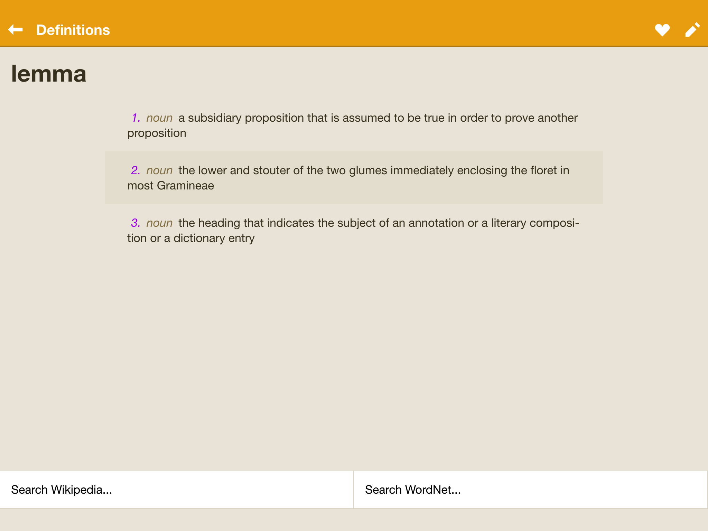
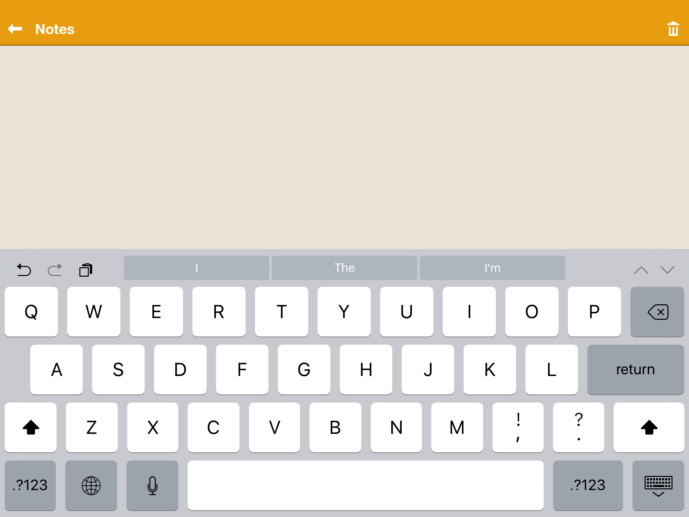
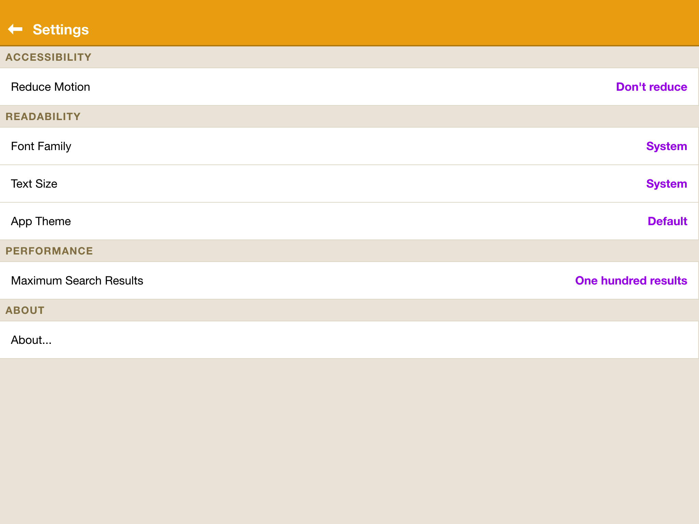
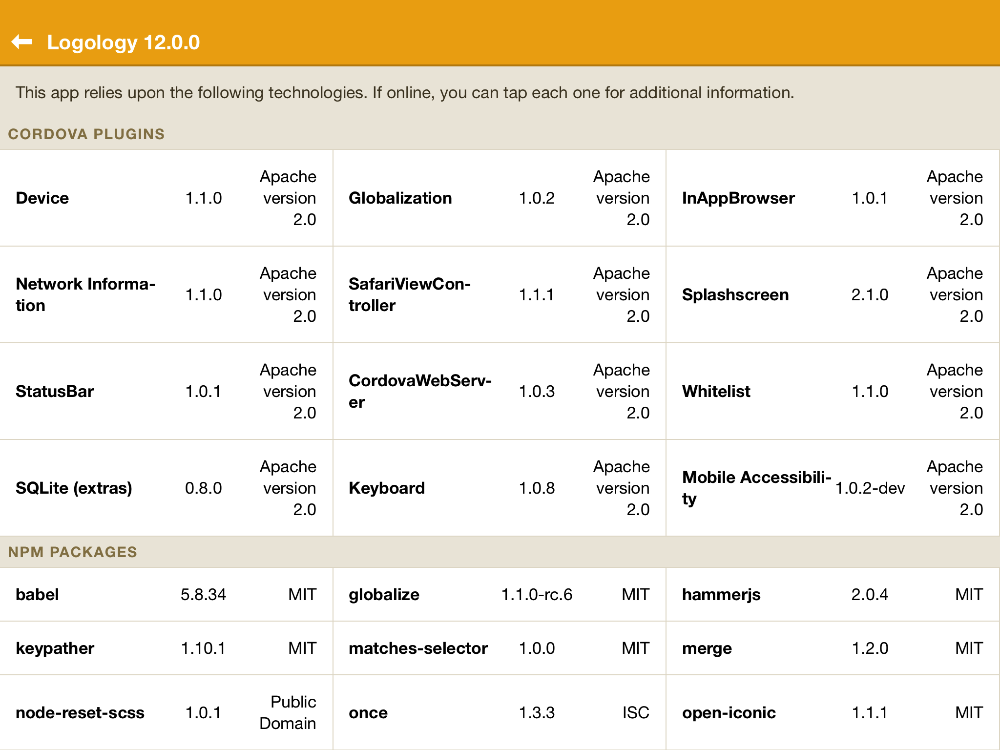

# Logology Application Structure

You can find the demonstration app, Logology, in various stages of completion in the directories `logology-v04` through `logology-v12`. The final version is in `logology-v12`. This document describes the final version (12), with notes for the other versions as applicable.

> **NOTE**: Development of Logology is ongoing. This occurs in the `logology` directory. If you wish to watch the changes or contribute new changes, this is the place to look.

## Design

The visual design is fairly standard for an app that displays lists of data. You
can see [the visual design PDF](design/visual design and flow.pdf), which
describes the appearance and functionality at a very high level. Alternatively,
you can refer to the screen captures below, which show the app as it actually
renders.

As of this writing, Logology has the following features:

 - Search for words in a dictionary
 - View definitions for a word
 - Add a word to favorites (or remove)
 - Create / Edit notes for a word (or remove)
 - Change Settings (Including Accessibility, Readability, About)

Internally, the application itself demonstrates several uses that hybrid
applications can use:

 - Accessibility
 - Responsive design
 - Complex layout using Flex-Box
 - Gesture support and fast click via Hammer.js
 - Persistent storage using localStorage, IndexedDB, and SQLite
 - Management of the Status Bar using the Cordova Status Bar plugin
 - Management of the Launch Image using the Cordova Splash Screen plugin
 - Soft-keyboard avoidance using the Ionic Keyboard plugin
 - Adjustment of settings and visual appearance based on device platform using
 the Cordova Device plugin

Visually the application consists of five screens:
 
1. "Search" view

    

    The user can search for a word, and the view will return found results. The word can be a partial match, but the match only occurs from the beginning of the word.

    > On iOS, the words have actions that can be revealed when the user swipes right-to-left. This feature is disabled on Android.
    
2. "Definition" view

    
    
    The available definitions are displayed for a given word. Although not obvious from this screen shot, the user can select the text so that they can copy it to their clipboard.
    
    There are two additional actions at the bottom of the screen which will launch an InAppBrowser to show additional information about the word. Technically these are configurable, but no UI exists to configure them at the moment.
    
    There are two actions in the upper-right corner as well -- you can favorite the word (or remove it from favorites), and you can create/edit a note about the word.

3. "Notes" view

    

    This is a pretty basic `<textarea>` that accepts user input. If a note already existed for this word, it would be rendered here.
    
    The trashcan icon in the upper-right allows the note to be deleted.

4. "Settings" view

    
    
    * Reduce motion allows the user to enable or disable animations. These can sometimes affect an individual who is sensitive to on-screen motion. Disabling this also has the side-effect of improving navigation performance on Android.
    * The user can select from a variety of font families. At the moment these are hard-coded (not dynamic), and not all the families are supported on Android. In the future, it would be nice to include web fonts.
    * The text size automatically reflects the user's dynamic text size setting obtained from the operating system. If they wish to override it, they can do so using the `Text Size` setting.
    * There are three app themes available -- the default one (shown in the screen shots), a white theme and a dark theme.
    * Scrolling performance is dependent upon how many items are returned in a search. As such, the `Maximum Search Results` setting is initially limited based on the device (80 for Android, 100 for iOS). The user is free to bump this up to `200`.

5. "About" view

    
    
    This screen describes the app a little, and includes supporting modules and licenses. Clicking on an item will display an InAppBrowser window pointing at the item's website.

## Structure

Even though the app is a fairly simple application, there's still quite a bit going on. A lot of this is scaffolding that would be similar for just about any app. The actual files devoted solely to the app's functionality are much fewer.

### Overall Directory Structure

If you look within a project and look at the top-level directories, you'll see a structure like this:

* `build/`: build artifacts. The Cordova project is actually generated here. If you haven't initialized the project yet (with `gulp init`), this directory may not yet exist.
* `config/`: Linting and style checking configuration settings.
* `gulp/`: Build and testing tasks.
* `node-modules`: Dependencies installed when you run `npm install`. If you haven't done so, this directory may not yet exist.
* `src/`: Source files, including HTML, JS, and SCSS files.
* `test/`: Code tests
* `test-ui/`: UI automation tests

You'll also see a few top-level files:

* `build.json`: signing configuration. This is only for version 12 (the final version in the book). You'll have to alter this to sign your own builds.
* `gulpfile.json`: bootstrap for any Gulp tasks
* `package.json`: Information and configuration settings for the app

#### Source files

The source files live within `src/`, and are used during the build process. These files require many transformations in order to create a functional app, hence a build step. These transformations include ES2015 --> ES5, SCSS --> CSS, and more. The typical `config.xml` file used by Cordova is generated during a build step as well and merges values in `package.json` with the template in `src/config.xml`.

There are two directories within the `src/` folder:

* `res/`: launch screens and app icons
* `www/`: HTML5, SCSS, and JS code

We won't go into detail about the launch screens and app icons -- there is an entire chapter in the book devoted to how those are configured. Instead, we'll go into the code structure.

There are several files and folders of interest within `src/www/`:

* `index.html`: bootstrap HTML file
* `img/`: bitmapped image files. SVG icons used in the app are actually present in `node_modules` at this point and copied over during the build phase.
* `js/`: JavaScript code. This is ES2015 (and higher) code, and requires transformations before Cordova can use the code.
* `scss/`: Sassy CSS. These will be converted to CSS files during the build phase.
* `wordnet.db`: SQLite version of the Wordnet Database
* `wordnet.json`: JSON version of the Wordnet Database (for environments without SQLite support)

##### index.html

This file is loaded when the app is initially launched. Some important notes about this file:

* Serves as the bootstrap; as such there's not a lot of DOM elements or the like here.
* The `Content-Security-Policy` `meta` tag defines the acceptable sources for several asset categories. Sources that are not included will be ignored by the app's browser environment.
    * The `default-src` option is the fallback if nothing is specificed for a certain category.
        * `'self'` is required to load elements from the app's own assets
        * `gap://*` is required on iOS to communicate with the native portion of our hybrid app
        * `ws://*` is required if using within a BrowserSync environment; BrowserSync uses sockets to notify clients when they should reload
        * `https://ssl.gstatic.com` is required if Android Talkback is to be usable for the app
    * `img-src` includes `data:` -- which allows inline images to be loaded. This is key for the app's use of SVG icons.
    * The use of `unsave-inline` is not ideal, since it permits inline styles and script. However, these were necessary to enable for our app.
    * The use of `unsafe-eval` is also not ideal, since it permits JavaScript's `eval` statement. Again, it was required for full functionality in our app.
* The `viewport` `meta` tag lets mobile browsers know that this is an app, not a web page. In short, no scaling (pinch-to-zoom) is allowed, and the width reported to our code will be the device's width. This also has the benefit of letting some environments know that they should allow fast taps instead of slow taps, since the double-tap gesture for zooming is no longer possible.
* A non-existent stylesheet is loaded -- this is generated from the `src/www/scss/` directory during the build phase.
* Likewise, a non-existent script is also loaded -- again, this is generated during the build phase.
* The `#rootContainer` element within the file is the element to which the app's views attach programatically. If this element is not present, the app will fail to launch.
* The `#svg-sprite` element loads in the SVG icon assets. The build phase copies these from a dependent module into `build/wwww/img/open-iconic/sprite.svg`. Without this element, the app will fail to render icons correctly.

##### Sassy CSS

Before we delve into the JavaScript code for the app, let's take a quick look at the CSS structure:

* `app.scss` sets some default variables (generally colors), and then proceeds to import the `base` SCSS as well as each available theme.
* `lib` defines the base layout for the app. This includes navigation bars, lists and list items, icons, etc. Thank of this as a basic framework library.
* `themes` define the look for each theme. Each theme strives only to override the rules necessary to accomplish the theme -- otherwise they rely on the base rules defined in `lib`.
    > **NOTE**: Each theme is responsible for importing the necessary files in `lib`; the colors defined in the theme will then be inherited by the files imported from `lib`.
* `views` define any rules that are necessary for each view. Since there are five main views, there are five corresponding files. These also provide only the necessary overrides for each view.

The majority of the styling is handled in `lib/` -- see the following files:

* `_alert.scss`: Styles for alerts (not used in this app)
* `_bar-navigation.scss`: Styles for navigation bars
* `_bar.scss`: Styles for bars in general
* `_base.scss`: Some basic styles that apply everywhere
* `_button.scss`: Essentially make <button> not look like a browser button
* `_container.scss`: Container styles
* `_glyphs.scss`: Not used
* `_list.scss`: Styles for lists, list items, list actions
* `_navigation-view-controller.scss`: Basic styles for the navigation controllers themselves
* `_split-view-controller.scss`: Split view controller (not used in app)
* `_svg.scss`: Styling for SVG icons

The themes in `themes/` will load all the above files after having set their desired colors scheme. The only exception is `_base.scss`, which is loaded directy by `app.scss`.

There are also several animation files inside `themes/` that control how animations work on the various platforms.

During the build phase, all of the files are compiles into a single CSS file.

##### JavaScript Code

There are two folders within `src/www/js/`:

* `app/`: application-specific code
* `lib/`: supporting code (framework; re-usable modules; etc.)

You can think of the files within `lib/` as the app's framework. These files are generic in nature, and do not implement any of the app's actual features. They *do* assume that you're using the styling we've already discussed before, however.

###### Library Support

Within `lib/` are several important folders and files:

* `Controller.js`: Generic controller

* `grandCentralStation.js`: An emitter that is shared across the entire app; allows global communication

* `NavigationViewController.js`: Generic Navigation View Controller. Handles push/pop/popToRoot

* `SoftKeyboard.js`: Handles the appearance of the soft keyboard, and resizes the view as appropriate for iOS.

* `SplitViewController.js`: Generic Split View controller. Not used in the app.

* `Theme.js`: Generic theme. Specifies the classes that should be used by theme styles.

* `ThemeManager.js`: Manages the app's look and feel. The app itself has three themes (instances of theme.js) and this file handles the application of those themes

* `View.js`: Generic View. Contains most of the logic regarding rendering, templating, events, etc.

* `ViewController.js`: A Controller than manages a View.

* `WebSQL.js`: Web SQL wrapper

* `templates/`: Basic widget templates

    * `el.js`: Returns a DOM element; used by the files in `widgets/` below

    * `widgets/`: Widget templates

        * `bars/`: Bar-specific templates

            * `navigation.js`: Generates a navigation bar

        * `container.js`: Creates a container

        * `genericWidget.js`: Creates a generic widget (used by the other widgets in this folder)

        * `glyph.js`: Creates a glyph (with an SVG icon)

        * `list.js`: Creates a list container

        * `listHeading.js`: Generates a list heading

        * `listIndicator.js`: Returns a glyph suitable for a list indicator (a-la iOS)

        * `listItemActions.js`: Returns a list actions segment (for swiping)

        * `listItemContents.js`: Returns a container for the actual contents of a list item

        * `listItemSpacer.js`: Creates a space between list items

        * `scrollContainer.js`: Generates a container that can scroll

        * `svg-icon.js`: Returns an SVG Icon. Maps some commonly used names to their open-iconic variants

        * `textContainer.js`: Creates a text container (NOT an editor

If you look at the various templates and widgets, you'll quickly discover that the app does not deal with straight HTML. Instead, everything you see on-screen are programatically created DOM elements. Whenever a view needs to update its visible contents, the DOM elements are regenerated and inserted into the DOM. This is very superficially like React, except that the app uses neither a virtual DOM nor executes diffs against the DOM tree. In that vein, the app is not the fastest thing around, but the code --> DOM path is easy to reason about.

###### Application code

The application-specific code lives in `src/www/js/app`, and the structure looks like this:

* `index.js`: App Bootstrap; contains initialization and routing code

* `controllers/`: View Controllers

    * `AboutViewController.js`: Renders the About View chrome and manages the About View itself

    * `DefinitionViewController.js`: Renders the Definition View chrome and manages the Definition View

    * `GenericViewController.js`: A generic view controller with a default navigation bar and basic events

    * `NotesViewController.js`: Renders the Notes editor View chrome and manages the editor itself

    * `SearchViewController.js`: Renders the Search View chrome, accepts input from the user, and manages the search results

    * `SettingsViewController.js`: Renders the Settings View chrome and manages the Settings View itself

* `lib/`: Utility modules

    * `indexedDBKVStore.js`: key-value store using IndexedDB  (chapter 7)

    * `KVStore.js`: key-value store that can accept different storage mechanisms

    * `LocalStorageKVStore.js`: key-value store using LocalStore (chapters 4 - 6)

    * `WebSQLKVStore.js`: key-value store using Web SQL (chapter 8 and beyond)

* `localization/`: Translations

    * `localization.js`: Localization stub

    * `root/`: Root messages

        * `messages.json`: Default translations (English)

* `models/`: Data Models

    * `Definition.js`: Represents a single definition

    * `Definitions.js`: Represents a collection of definitions.

    * `Dictionaries.js`: Represents a collection of dictionaries.

    * `Dictionary.js`: Represents a dictionary based on an Array

    * `Favorites.js`: Represents favorite words (uses the key-value stores in app/lib/)

    * `Note.js`: Represents a single note (uses the key-value stores in app/lib/)

    * `Notes.js`: Represents notes for words (uses the key-value stores in app/lib/)

    * `Settings.js`: Represents the app's settings (uses localStorage for persistence)

    * `SQLDictionary.js`: Represents a dictionary using a Web SQL database as the source

    * `StarterDictionary.js`: A simple dictionary of only a few words; based on the basic Dictionary.js

    * `XHRDictionary.js`: Represents a dictionary using an Array; retrieves the data using XHR

* `views/`: Views and templates

    * `AboutView.js`: Renders information about the app and the open source libraries used

    * `DefinitionView.js`: Renders the definition for a single word. Also includes external links to other resources

    * `lemmaActions.js`: A template that generates the available actions for a word (can be passed fav/note status)

    * `lemmaList.js`: A template that generates a list of words

    * `MenuView.js`: Renders a menu suitable for a sidebar. (Not currently used)

    * `NotesView.js`: Renders an editor for viewing / editing a note

    * `SearchView.js`: Renders the primary view -- the search view

    * `SettingsView.js`: Renders the available settings and their current values

### Gulp Tasks

Gulp is used to run tests and generate builds. You can see the available commands by executing `gulp help`, which results in the following output. You can see the code for each task by looking under `/gulp/tasks/<task-name>`.

* `build`: Generates a build of the project. The following flags can be used to change the build behavior.

    * `--mode=debug | release`: Specifies the build mode. Also impacts code transformation; see `copy-code`. Debug is the default mode.

    * `--for=<platforms>`:
            Indicates the platform or platforms for which to generate a build.
            If multiple platforms need to be specified, they can be separated
            by a comma.

    * `--target=<device> | device | emulator`:
            Generates a build suitable for the specified device. The type of
            device (device or emulator) can be specified generically, or a
            specific device name can be used. This name must match what one
            would pass to the `--target` flag when using the Cordova CLI

* `clean`: Removes the build directory

* `code-style`: 
    Checks your project's code style using jscs. The configuration is taken from
    `<project-root>/config.jscs.json`

* `copy-assets`:
    Copies files that don't need transformations to the build directory.
    Equivalent to `cp` or `copy` command.

* `copy-code`:
    Transforms the JS and ES2015 code in the source directory and writes the
    result to the build directory. ES2015 is transpiled using Browserify and
    Babel. The output is controlled by various flags:
    
    * `--mode=release | debug`:
        * `debug`: generates debugging information and source maps. DEFAULT
        * `release`: removes debugging information, source maps, and also
                     uglifies the code automatically.

* `copy-config`:
    Copies and populates the 'config.xml' template in the source directory and
    writes the result to the build directory. Most of the parameters are stored
    in 'package.json'.

* `copy-scss`:
    Transforms the SCSS files in the source directory and writes the result to
    the build directory using NODE-SASS.

    NOTE: 'package.json' can be used to specify SCSS modules and paths to
    include, as follows:

        {
            "sass": {
                "includeModules": [
                    "node-reset-scss"
                ],
                "includePaths": [
                    "./node_modules/node-reset-scss/scss"
                ]
            }
        }

* `copy`: Copies assets, styles and code

* `emulate`:
    Builds the project targeting an emulator. The emulator is then started, if
    possible, and the app is started within the emulator. If the emulator can't
    be started automatically, you should start the emulator manually prior to
    executing this command.

    * `--platform=<platform>`:
            Specifies which platform to emulate, e.g., `ios`, `android`

* `find-licenses`:
    Find licenses used in packages used by the project and place into
    the `audit/` directory.

* `help`:
    Displays help. Use --filter to limit your results; case sensitive.

        "gulp help --filter copy"

* `init`:
    When executed, the `build/` directory is removed and rebuilt. Execute this
    whenever you add or remove plugins and platforms.

* `lint`                                                       Lint the project code
    Lints your project's code using eslint. The configuration is taken from
    <project-root>/config/eslint.json

* `run`:
    Builds the project targeting a physical device. The device must be connected
    to the development machine. Once connceted, the app should automatically
    launch on the device.

    * `--mode=debug | release`:
            Specifies the build mode. Also impacts code transformation; see
            `copy-code`. Debug is the default mode.

    * `--platform=<platform>`:
            Specifies which platform to emulate, e.g., `ios`, `android`

* `serve`:
    Creates a Browser Sync server that serves the source `www/` directory. This is
    extremely useful when testing, both on the local development machine using
    Chrome or Safari, but also the device itself using either the web browser
    on the device or using the PhoneGap Developer app

    * `--mode=debug | release`:
            Affects the generated output. See copy-code for more.

* `test-phantom`:
    Executes code-level tests in `./test` using Mocha and PhantomJS
    Run with `--watch yes` to watch and run in other browsers.

* `test-ui`:
    Executes UI Automation tests in `./test-ui` using Mocha and Appium

    * `--ignore [build][,copy]`:
            
        * `build`:
                bypasses the build phase; useful when the code being tested hasn't
                changed.
        * `copy`:
                bypasses the copy phase; useful when the code being tested hasn't
                changed.

    * `--target device|emulator`:
            change the build target. `device` is assumed by default.

    * `--profile <device_profile>`:
            target the specified device profile; required

    * `--server local|remote`:
            Use the local or remote server; `local` is the default

    * `--udid <device udid>`:
            Target iOS device UDID; required for testing on physical devices

    * `--verbose`:
            Display verbose logging information during tests.

    See the `build` task for more configuration settings regarding builds.

* `test`:
    Executes code-level tests in `./test` using Mocha

* `version-bump-major`:
    Increases the major portion of the version in package.json by one. For
    example, if package.json's version is at 1.2.3, the version after the bump
    will be 2.0.0

* `version-bump-minor`:
    Increases the minor portion of the version in package.json by one. For
    example, if package.json's version is at 1.2.3, the version after the bump
    will be 1.3.0

* `version-bump-patch`:
    Increases the patch portion of the version in package.json by one. For
    example if package.json's version is at 1.2.3, the version after the bump
    will be 1.2.4

* `watch`:
    Creates a Browser Sync server that watches the source www directory. This is
    extremely useful when testing, both on the local development machine using
    Chrome or Safari, but also the device itself using either the web browser
    on the device or using the PhoneGap Developer app

    * `--mode=debug | release`:
            Affects the generated output. See `copy-code` for more.

#### Building the app

You can build the app by following these steps:

* Update `build.json` to reflect your signing keys if you intend on generating a release build.
* Execute `npm install` to install dependencies
* Execute `gulp init` to initialize the `build/` directory
* Execute `gulp build` with desired parameters -- for example, `gulp build --mode=release --for=ios --target=device`

#### Running Tests

You can run tests by using the following commands:

* `gulp test`: executes code tests using Mocha
* `gulp test-phantom`: executes code tests in browser environment using PhantomJS. Requires PhantomJS to be installed before execution.
* `gulp test-ui`: executes UI Automation tests using Appium.

## Suggestions for Improvement

1. Add some web fonts for additional font options
2. Detect which fonts are available for a user so that invalid options are not displayed in the `Font Family` setting.
3. If the text size is set to the largest setting, some smaller phones may not be able to render the entire user interface. Consider only allowing this setting on larger screens.
4. Consider implementing an infinite scroller instead of the limited search results that are currently present.
5. Add additional app themes.
6. Use virtual DOM trees and tree diffing to improve performance.
7. Add sharing capabilities via email, Twitter, etc.
8. Create additional dictionaries (say, for other languages), and allow the user to download them and add them to the app.
9. Add a gesture handler to allow the user to swipe left-to-right to navigate backwards in the view stack.
