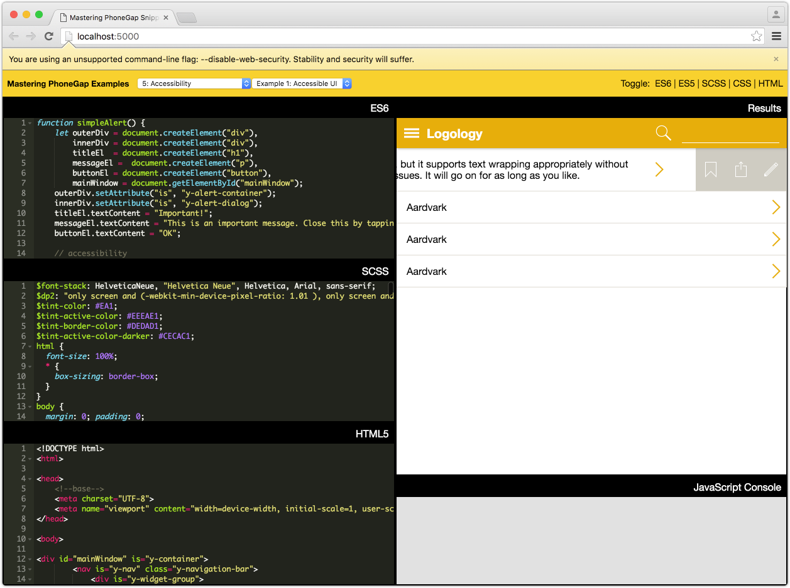
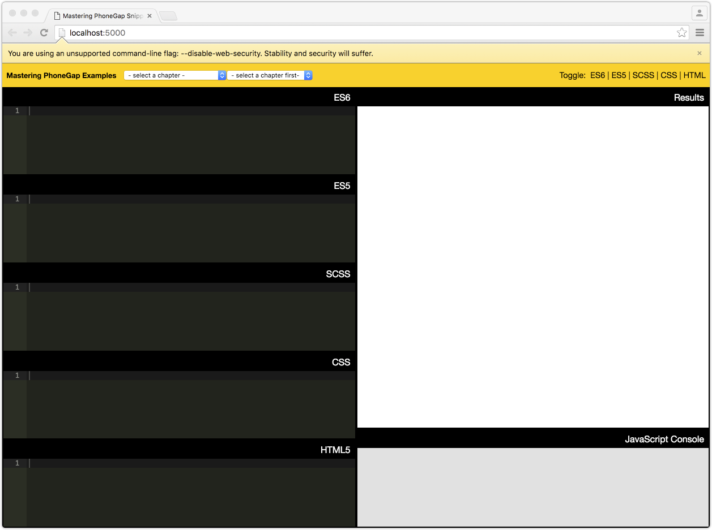

# The Interactive Playground

This code package includes an interactive playground you can use to play around with several of the code snippets included in the book. The interactive playground includes snippets from *most* but not *all* of the chapters.



## Starting the Interactive Playground

Before starting the playground, you need to ensure that you have Node.js and Google Chrome installed on your system. Then you can start the interactive playground with the following sequence of commands:

1. Linux / Mac OS X using `bash`

    ```sh
    $ cd snippets
    $ npm install && npm start
    ```

2. Mac OS X using `fish`

    ```sh
    $ cd snippets
    $ npm install; and npm start
    ```

3. Windows

    ```sh
    % cd snippets
    % npm install
    % npm start
    ```

The interactive playground will start up in an initially blank state, as follows:



> If Google Chrome doesn't start up automatically, you can start it manually using the following command:

    $ /path/to/chrome/chrome --no-first-run --no-default-browser-check --disable-translate --disable-default-apps --disable-web-security --user-data-dir=tmp http://localhost:5000/
    
## Using the Interactive Playground

> **NOTE**: It is vital that you use the created instance of Chrome only for playing with snippets. The settings configure Chrome to be less secure so that the snippets can work from your local machine, but by doing so, any other pages you visit in the same Chrome instance would not receive the normal web security mechanisms.

In the upper-left of the interactive playground, you can select the desired chapter and snippet from the dropdowns, as seen below:


Selecting your desired snippet is easy. 

* Select the chapter from the first dropdown

* Select the desired snippet from the second dropdown

* Wait a couple of seconds while the resources load and transpile. Results are visible in the Results pane and in the JavaScript Console.

> **NOTE**: Some snippets only generate content in the JavaScript Console.

Although each snippet comes with its own preferred layout, you can enable or disable any of the editors as you like by clicking the `Toggle` items in the upper right corner of the page, as follows:


## Stopping the Interactive Playground

Closing down Google Chrome will not stop the underlying process -- you'll need to break the process to stop the local web server being used. This should be `Ctrl+C`, although your platform may use a different keystroke.

## Caveats and Notes

The snippets have occasionally been modified slightly to work better within the snippet environment. 

* `console.log` does not behave exactly like the browser's own version. As such, snippets may be modified slightly to reflect this, usually by using an array instead of variable parameters.

Sometimes multiple snippets are in one file, and so arrangements are made for each smaller example to co-exist within the same context.

The Chapter 9 (*File Transfers*) upload snippet will not work unless you have your own PHP environment that uses the `upload.php` script presented in the book.

Finally, not every snippet works within a browser-based environment. As such, this tool only provides snippets that can work within a desktop browser. This means that portions of Chapter 6 and all of Chapters 10 through 12 lack snippet representation in this playground.

## License

See the [LICENSE](./LICENSE) file for information on the various libraries used to build the snippets tool.

See [Wordnet's License (../wordnet/LICENSE-WordNet.md)](../wordnet/LICENSE-WordNet.md) for information about WordNet. Some samples use definitions from this dictionary.

